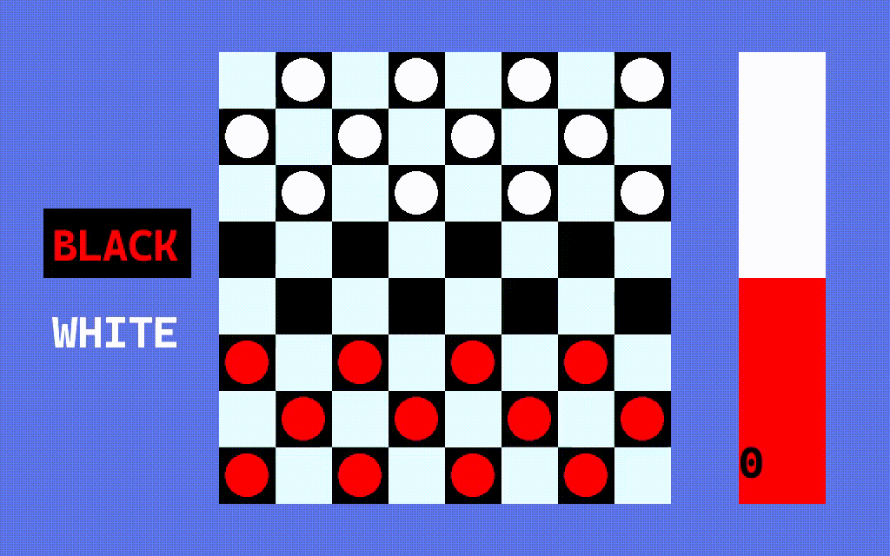

<h1>Английские шашки</h1>

Разработанное приложение позволяет пользователю сыграть в английские шашки против компьютера. GUI на C++ с использованием библиотеки для двухмерной графики SFML. Алгоритм поиска - минимаксный алгоритм из теории игр, выполняет поиск по усеченному дереву возможных ходов в партии и выбирает наилучший. Оценку конечным узлам дерева выдает простенький перцептрончик.

<h2>Демонстрационная версия:</h2>

